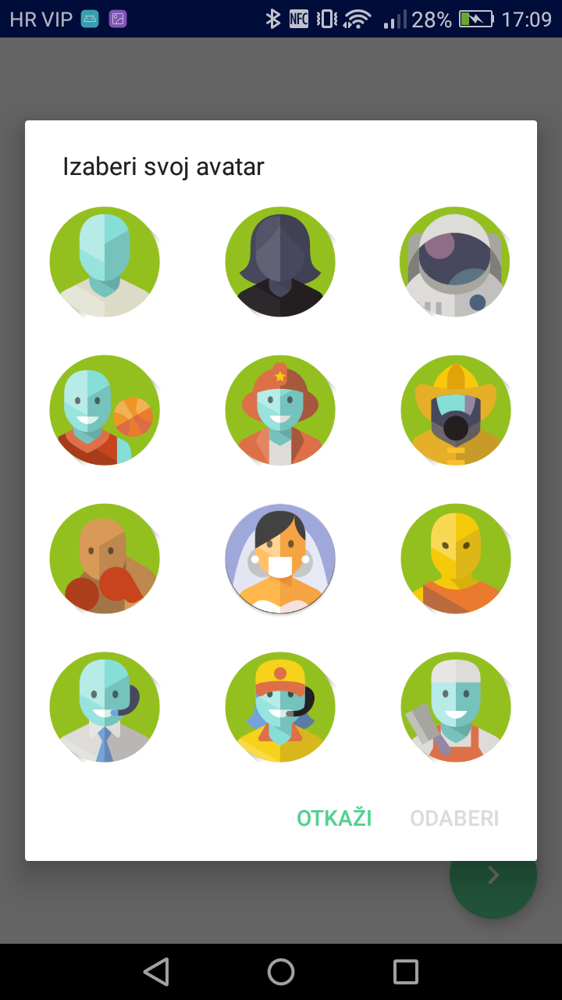

# Mozgalica

Android aplikacija za izradu informatičkih kvizova za osnovne i srednje škole

## Features

- grupacija kvizova po višim razredima osnovne škole i nižim razredima srednje škole
- 3 različita tipa pitanja: 1 ili više točnih odgovora, samo-procjena, slobodan unos
- Material Design ikone
- Unos novih izazova po razredima u XML
- mogućnost registracije više korisnika
- statistike
- postavke
- podržani jezici: hrvatski

## License

Mozgalica Android Quiz App
    Copyright (C) 2017

    This program is free software: you can redistribute it and/or modify
    it under the terms of the GNU General Public License as published by
    the Free Software Foundation, either version 3 of the License, or
    (at your option) any later version.
    

  
  
  
  

